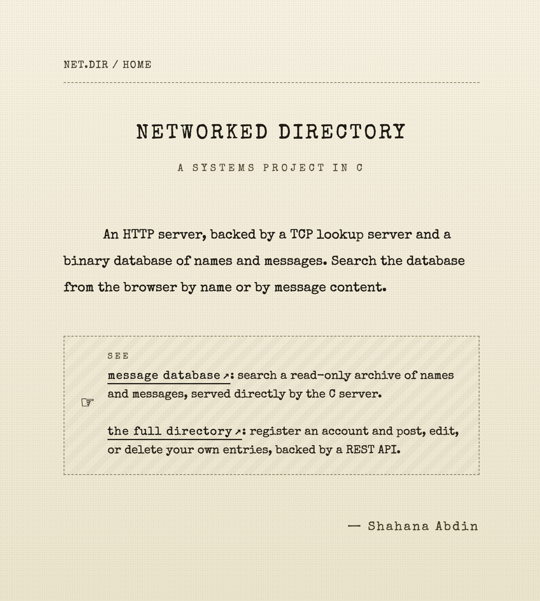
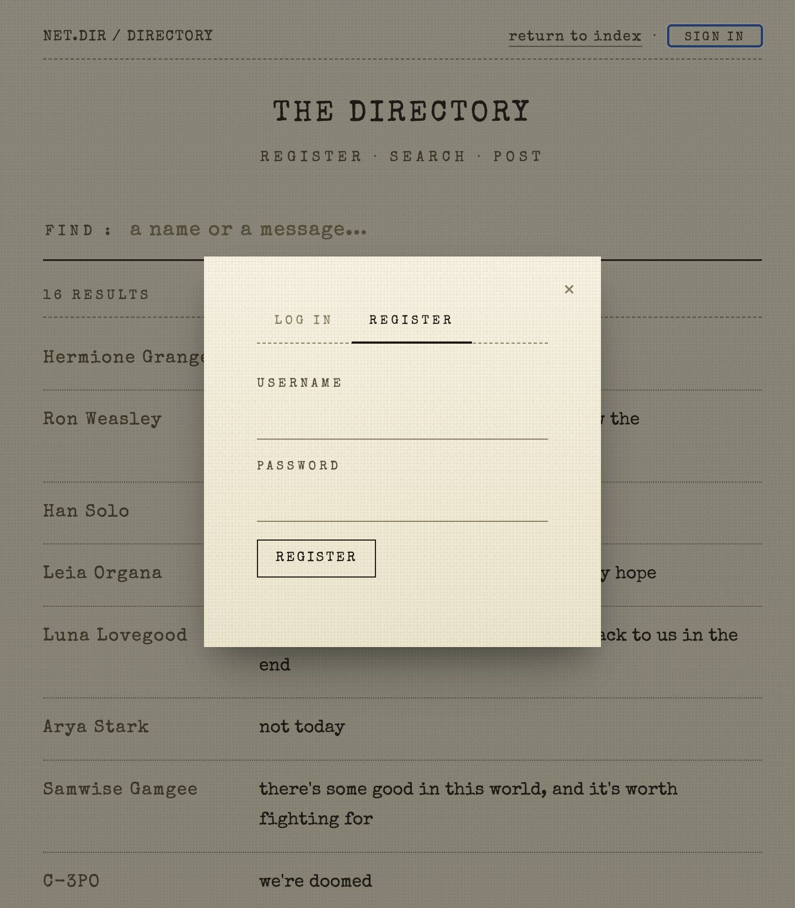
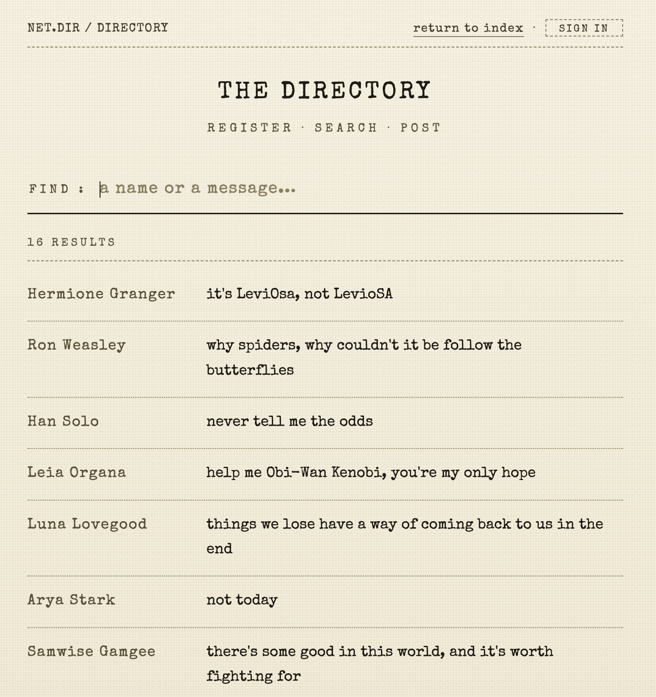
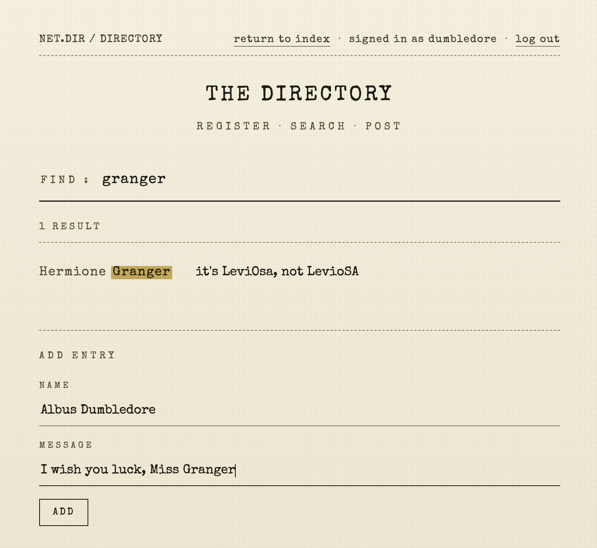
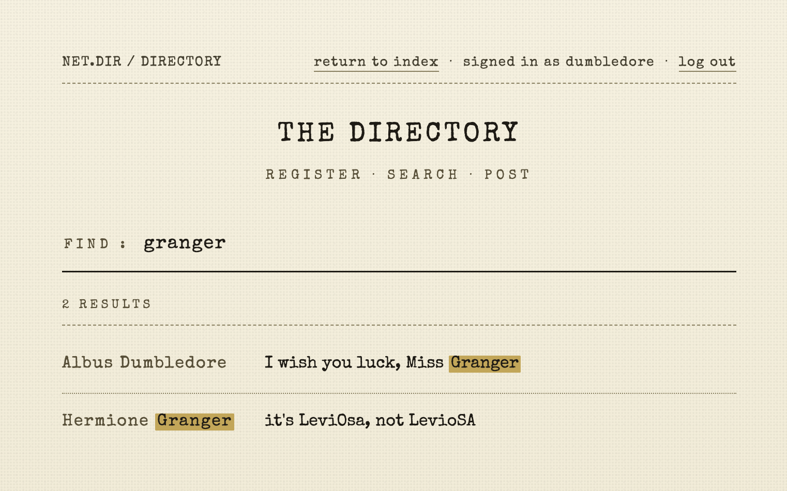

# Networked Directory

A multi-tier networked directory application built from scratch in two layers. The lower layer is a concurrent HTTP/1.0 server written in C: it parses raw HTTP requests, serves static files with binary-safe I/O, generates a search interface backed by a custom binary-record TCP server, and transparently proxies REST requests to an upper-layer backend. The upper layer is a FastAPI service with JWT authentication, bcrypt password hashing, and a SQLite database, exposed through a vanilla JavaScript frontend.

I developed the original C infrastructure out of a sequence of programming labs completed for a course at Columbia University, covering linked lists, binary file I/O, TCP socket servers, and HTTP. This project consolidates those pieces and extends them with a REST API tier and authenticated frontend.

---

## Architecture

```
  Browser
     |
     |  HTTP/1.0
     v
  http-server (C, port 8080)
     |               |               |
     |  static       |  TCP proxy    |  TCP proxy
     v  files        v  /mdb-lookup  v  /api/*
  www/            mdb-lookup-server  Python API (FastAPI)
                       |                   |
                       v                   v
                  data/mydb          api/directory.db
                  (binary)           (SQLite)
                       ^
                       |
                  mdb-add
```

The HTTP server opens a fresh TCP connection to `mdb-lookup-server` per child process, and a fresh TCP connection to the Python API per `/api/` request. There is no shared socket state across connections.

---

## Components

- **`http-server`**: fork-per-connection HTTP/1.0 server. Parses the request line and headers, routes to one of three handlers: static file serving from `www/`, an HTML search interface backed by the TCP lookup server, or a transparent proxy to the Python API. Each child process handles one request and exits.
- **`mdb-lookup-server`**: TCP server that reads a binary flat-file into a linked list of fixed-size records on startup, then accepts newline-terminated queries and returns all records whose name or message contains the query string.
- **`mdb-add`**: command-line tool that appends a single name/message record to the binary database file, prompting for input and writing the fixed-size struct directly.
- **`mdb-lookup`**: interactive command-line client that reads the binary database and answers substring queries from stdin, bypassing the TCP server entirely.
- **`http-client`**: minimal HTTP/1.0 client that connects to a host and port, sends a GET request for a given path, and writes the response body to stdout.
- **Python API** (`api/`): FastAPI service with user registration and login (bcrypt passwords, JWT tokens), and ownership-enforced CRUD endpoints for directory entries backed by SQLite.
- **`www/index.html`**: landing page served as a static file by the C server. Links to the legacy lookup and the full directory, and describes both.
- **`www/directory.html`**: single-page frontend with register, log in, search, add, edit, and delete. All actions go through fetch calls to the API, with the JWT held in a JS memory variable.

---

## Features

**mdb system**
- Binary flat-file database with fixed-size records
- TCP server loads the full record set into memory on startup and answers substring queries
- Case-insensitive search across name and message fields

**C server**
- HTTP/1.0 GET with correct status codes (200, 301, 400, 404, 500, 501, 502)
- Static file serving with binary-safe `fread`/`send` transfer
- 301 redirect for directory URLs missing a trailing slash
- Path traversal protection (`/../` and trailing `/..` blocked)
- `/mdb-lookup` endpoint with HTML form, search results, and search term highlighting
- `/api/` transparent proxy forwards the full HTTP request to the Python API and streams the response back
- Fork-per-connection concurrency; mdb and API connections opened only when the route requires them
- Zombie reaping via `SIGCHLD` / `waitpid(WNOHANG)`; `SIGPIPE` ignored; `SO_REUSEADDR`

**Python API**
- User registration and login with bcrypt password hashing
- JWT authentication (HS256, 24-hour expiry); tokens checked via `Authorization: Bearer` header
- Ownership-enforced PUT and DELETE. Returns 403 if the token's `user_id` does not match the entry's `user_id`
- Search entries by name or message substring

**Frontend**
- Register, log in, search all entries, add/edit/delete own entries
- Search terms highlighted in results

---

## Build

**C Binaries**

```sh
make all
```

Produces five binaries at the project root: `http-server`, `mdb-lookup-server`, `http-client`, `mdb-add`, `mdb-lookup`. Requires GCC and POSIX sockets.

```sh
make clean   # remove binaries
```

**Python Dependencies**

```sh
cd api
pip install -r requirements.txt
```

**Seed the databases**

```sh
make seed
```

Populates both `data/mydb` and `api/directory.db` with a default set of entries. Re-running wipes and resets both databases to the default state. Running `make all` on a fresh clone seeds them automatically.

---

## Usage

The mdb system is a binary database served by a standalone TCP server. Records are added through the command line with `mdb-add`. Once the lookup server is running, it can be searched through the browser at `/mdb-lookup` or interactively from the terminal using `mdb-lookup`.

**1. Create and populate the legacy database**

```sh
./mdb-add data/mydb      # prompts for name + message; run again to add more
```

**2. Start the lookup server**

```sh
./mdb-lookup-server data/mydb 9999
```

**3. Start the Python API**

In a separate terminal:

```sh
cd api && uvicorn main:app --port 8081
```

The database file `api/directory.db` is created automatically on first start.

Set `JWT_SECRET` in the environment to override the default dev secret:

```sh
JWT_SECRET=your-secret-here uvicorn main:app --port 8081
```

**4. Start the HTTP server**

In a separate terminal:

```sh
./http-server 8080 www localhost 9999 localhost 8081
```

Arguments: `<port> <web-root> <mdb-host> <mdb-port> <api-host> <api-port>`

Open `http://localhost:8080/` in a browser.

- `/`: project index page
- `/mdb-lookup`: search the legacy binary database
- `/directory.html`: full directory with registration, login, and entry management

**Standalone tools**

```sh
./mdb-lookup data/mydb        # interactive substring search from stdin
./http-client localhost 8080 /index.html   # download a file over HTTP
```

---

## Data Storage

Two separate databases are used at runtime.

The mdb database is a read-only binary flat-file, records are added through a command-line tool and served directly by the C lookup server. The directory database is a SQLite file managed by the Python API, where users can register accounts and post, edit, or delete their own entries.

**`data/mydb`**: binary flat-file database used by the mdb system. Created by `mdb-add` and read by `mdb-lookup-server` and `mdb-lookup`. The format is a sequence of fixed-size records defined in `src/mdb.h`.

**`api/directory.db`**: SQLite database used by the Python API. Created automatically on first start via `init_db()`. Holds the `users` and `entries` tables.

---

## Demo

**Landing Page**: The C server serves this as a static file from `www/index.html`



**Register/Log In Screen**: Clicking "Sign In" opens a modal with Register and Log In tabs.



**Full Directory**: All entries loaded via `GET /api/entries`



**Adding an Entry**: Logged in as `dumbledore`, searching for "granger" returns one existing result. The Add Entry form at the bottom is filled out and ready to submit.



**After Adding**: The same search now returns two results. The newly posted entry appears alongside the existing one.



---

## Concurrency Model

The server forks a child process for every accepted connection. The child handles one HTTP request and exits; the parent closes its copy of the socket and loops back to `accept()`. Each child has its own address space with no shared state or locking. Connections to `mdb-lookup-server` and the Python API are opened inside the child only when the route requires them.

A `SIGCHLD` handler calls `waitpid(-1, NULL, WNOHANG)` in a loop to reap multiple children finishing concurrently. `sigaction` with `SA_RESTART` prevents `accept()` from returning `EINTR` on signal delivery.

---

## Known Limitations

- **Percent-encoded traversal is not blocked.** The server rejects `/../` and trailing `/..` in the raw URI. Percent-encoded variants like `/%2e%2e/` are not decoded before the check and bypass it.
- **No HTTP/1.1 keep-alive.** Every response closes the connection. The server accepts HTTP/1.1 requests but always responds as HTTP/1.0.
- **No connection limit.** Each accepted connection forks a new process with no cap. A flood will exhaust the process table.
- **"My entries" filtered client-side.** The frontend fetches all entries and filters by `user_id` in the browser. There is no server-side filter endpoint.
- **Session does not persist across page reloads.** The JWT is held in a JavaScript memory variable, refreshing the page logs the user out.
